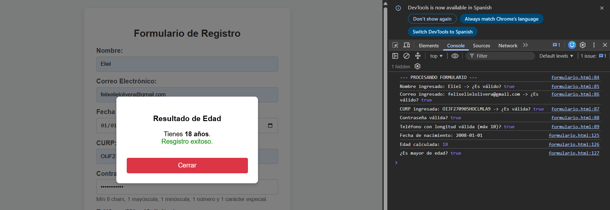
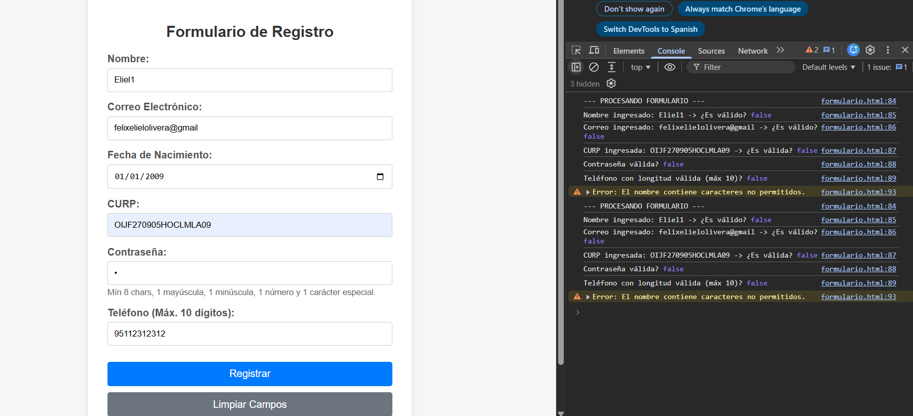
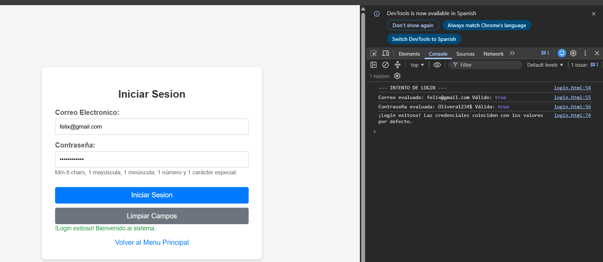
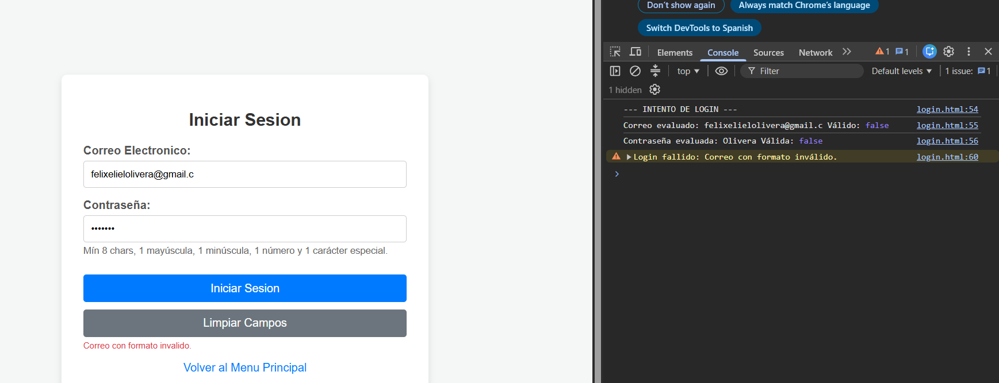

# Actividad 2: Librería utileria.js

---
# 🛠️ Utileria.js

**Autor:** Felix Eliel Olivera Jimenez

**Carrera:** Ingeniería en Sistemas Computacionales

**Institución:** Tecnológico Nacional de Oaxaca

## 🎯 ¿Qué problema resuelve?

En el desarrollo web actual, la validación repetitiva de formularios, el cálculo de edades, la comprobación de estructuras de datos estándar (como CURP o correos) y el manejo de contraseñas seguras suelen requerir la escritura de código redundante. **Utileria.js** resuelve este problema al proporcionar una librería ligera, modular y escrita en JavaScript puro (*vanilla*), libre de frameworks o dependencias visuales pesadas. Centraliza todas las reglas de validación y utilidades comunes para integrarse de forma limpia en formularios, modales y sistemas de autenticación.

---

## 📦 Instalación

Para utilizar la librería en tu proyecto, simplemente descarga el archivo `utileria.js` dentro de tu carpeta `/js`(o en donde tengas guardados tus archivos Js) e impórtalo antes de tus scripts de lógica en cualquier archivo HTML mediante la etiqueta script:

```html
<script src="js/utileria.js"></script>

```

---

## 💻 Uso y Ejemplos de Código

Una vez importada la librería, todas sus funciones están disponibles a través del objeto global `Utileria`. A continuación se muestra el código real de cómo implementar cada una de sus funciones:

### 1. Validar Correo Electrónico

Valida que una cadena cumpla con la estructura oficial de un correo electrónico.

```javascript
const correoValido = Utileria.validarCorreo("felix@itoaxaca.edu.mx"); 
console.log(correoValido); // true

```

### 2. Validar Solo Letras

Comprueba que el texto contenga únicamente caracteres alfabéticos, espacios y vocales acentuadas.

```javascript
const nombreValido = Utileria.soloLetras("Félix Eliel"); 
console.log(nombreValido); // true

```

### 3. Validar Longitud de un Número

Verifica que la longitud de una cadena numérica no rebase un límite máximo establecido.

```javascript
const telefonoValido = Utileria.validarLongitud("9511234567", 10); 
console.log(telefonoValido); // true

```

### 4. Calcular Edad

Calcula el número entero de años exactos transcurridos a partir de una fecha de nacimiento.

```javascript
const edad = Utileria.calcularEdad("2005-09-27"); 
console.log(edad); // Retorna la edad actual calculada

```

### 5. Validar Mayoría de Edad

Retorna un booleano indicando si la persona es mayor o igual a 18 años.

```javascript
const esAdulto = Utileria.esMayorDeEdad("2005-09-27"); 
console.log(esAdulto); // true

```

### 6. Validar Contraseña Segura

Exige un mínimo de 8 caracteres, al menos una letra mayúscula, una minúscula, un número y un carácter especial.

```javascript
const passwordValido = Utileria.validarContra("System2026*"); 
console.log(passwordValido); // true

```

### 7. Limpiar Campos Automáticamente (Función Libre 1)

Limpia de forma automatizada todas las cajas de texto contenidas en un formulario o contenedor HTML.

```javascript
const formulario = document.getElementById("registroForm");
Utileria.limpiarCampos(formulario);

```

### 8. Validar Estructura de la CURP (Función Libre 2)

Valida el formato estándar oficial de 18 caracteres de la CURP en México.

```javascript
const curpValida = Utileria.validarCURP("OIIF050927HOCJMN09"); 
console.log(curpValida); // true

```

### Capturas de Pantalla

**Validación en el Formulario y Modal:**


**Inicio de Sesión (Login):**



### Video Demostrativo 

Haz clic en la imagen para ver el video explicativo de la librería en YouTube:

[](https://youtu.be/3ZFottIS0Mo)